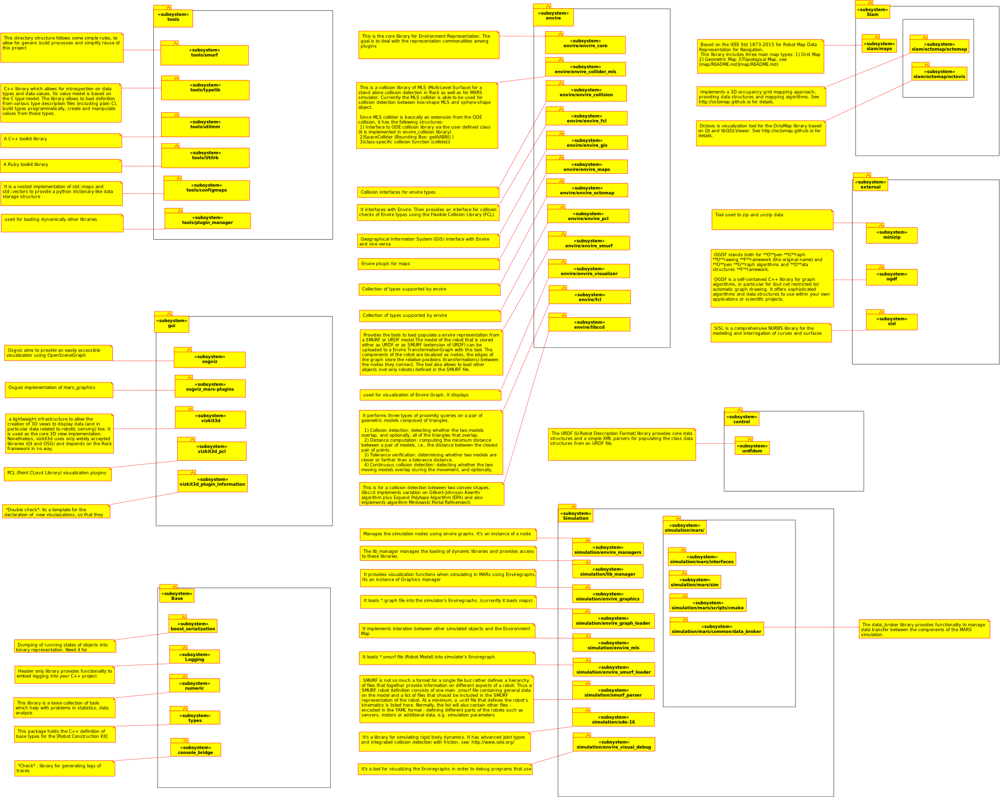
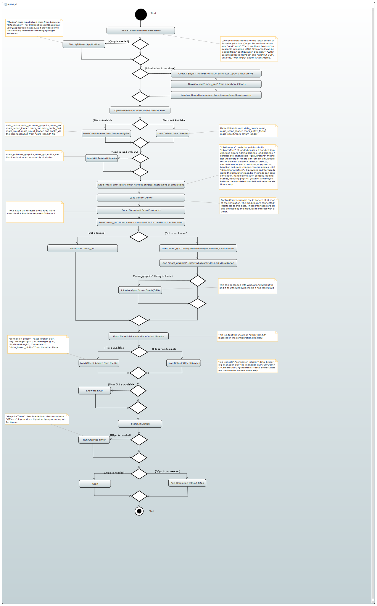

## Contents

0. [Quick Instructions](ReadMe.md#quick-instructions)
0. [TroubleShooting](ReadMe.md#troubleshooting)
0. [Introduction to Envire and EnvireMars](ReadMe.md#introduction-to-envire-and-enviremars)

## Quick Instructions

First of all, we need to Install MARS Environment. 

We need to perform the following steps without usings sudo (to avoid generating files and folders owned by root). Now, open the Terminal or Command Prompt and follow the following steps step-by-step.

0) Install the dependencies of [Autoproj](https://github.com/rock-core/autoproj):

```   
   $ apt-get update
   $ apt-get install -y build-essential ruby ruby-dev sudo wget
```

1) Create a folder where your environment will be checked out and installed.
```
   $ mkdir mars_dev
   $ cd mars_dev
```
From here on, perform the steps from the newly created directory.

          
2) Download the autoproj bootstrap script

```
   $ wget http://rock-robotics.org/autoproj_bootstrap
```          
    
3) Run the boostrap script and provide the repository address

If your user has set up his/her keys in the github and gitlab account, then use this command

```
   $ ruby autoproj_bootstrap git git@github.com:envire4mars/simulation-buildconf.git branch=envireMars
``` 
 
If the user has not generated the SSH key and set it up in his/her github and gitlab account then use this command

```
    $ ruby autoproj_bootstrap git https://github.com/envire4mars/simulation-buildconf.git branch=envireMars
```        

Answer "whether C++11 should be enabled for Rock packages [false]" with "true" and the other with default (just hit enter)    
    
4) Source your environment

```
    $ source env.sh
```

5) Check out updates
```      
    $ autoproj update
```          
6) Build your environment
```      
    $ autoproj build        
```    
This step will start building everything.
    
7) Check for instance that mars_app is installed. To launch the mars application: 
```
    $ mars_app          
```    

In mars_app you can load different environments and robots of your choice.
    
 ## TroubleShooting
 
1- No Access Right:

Sometimes you may face the problems like "No Access Rights to your repository": Make sure you have corrected generated the SSH Key for both GitLab and GitHub
    
Similarly, sometimes you don't have access to the specific Repository forexample:
"No Access Rights to git@git.hb.dfki.de/models-environments" 
In this case, you have to make an access request to the maintainer/owner of that Repository. 

2- PROGRAM STUCKS AFTER ENTERING ` autoproj update `

If you are on step NO:05 and your program got stuck while checking out Models Environment and Models Robots. 

You can checkout each robot/environment separately to overcome this problem.

Let say  we need to install spacebot_cup robot.
Todo so use:
```    
    $ autoproj update models/environments/spacebot_cup
```              
Similarly do same for all the other robots like asguard_v4 etc.

    
3- AFTER ENTERING ` autoproj build `.

Maybe you get an error "CMake fails to compile the simple test".
There are two possibilites to overcome this problem: 

First of all install build essential using the correspondent command:
```    
    $ sudo apt install build-essential
```              
If you are still having the same error, then you can try by removing ccache. The default configuration does not use ccache but sometimes errors are triggered if it installed but not selected for use. You can remove ccache with
```
     $ apt-get remove ccache
```

## Introduction to Envire and EnvireMars

### Envire

The envire graph is the backbone of the whole library. It stores arbitrary data and time & space transformations between the data. 

Envire is mainly used in navigation as a package for expressing arbitrary information about a robot's environment, but it could be extended to also include robot environment interaction for manipulation.

The reason for having a common datastructure for representing the environment is, among others, to simplify the interchange of environment representation information between applications/algorithms. Envire package is mainly made up of three types of objects. 

1) Maps - give information in a given reference frame.

2) Frames - provide the spatial context for the maps

3) Operators - carry out operations on maps by considering the maps' frame associations 

#### More details 

0. [Official introduction to Envire](http://envire.github.io/docs/intro_about_envire.html)

0. [Hidalgo Carrió, et al, EnviRe - Environment Representation for Long-term Autonomy, AI for Long-term Autonomy Workshop on the International Conference on Robotics and Automation (ICRA). IEEE International Conference on Robotics and Automation (ICRA-16), May 16-20, Stockholm, Sweden, 2016.](https://www.dfki.de/fileadmin/user_upload/import/8365_Hidalgo-Carrio_et_al._-_2016_-_EnviRe_-_Environment_Representation_for_Long_Term_Autonomy.pdf)

0. [Official introduction to Envire_Core](https://github.com/envire/envire-envire_core#build-and-test-status)

### MARS 

MARS (Machina Arte Robotum Simulans) is a cross-platform simulation and visualisation tool created for robotics research developed at the DFKI-RIC and the University of Bremen. It runs on (Ubuntu) Linux, Mac and Windows and consists of a core framework containing all main simulation components.

Those components are: 

1) Open Scene Graph (OSG) for its visualisation
2) Open Dynamics Engine (ODE) for the physical simulation
3) Qt for the GUI

#### More details  

0. [Official introduction to Mars](https://github.com/rock-simulation/mars)

### UML Diagrams of EnvireMars

#### 1) Package Diagram of EnvireMars



This Package Diagram can be edited by using UML designing tool called ["Umbrello"](https://umbrello.kde.org). Source files are inside the [Envire_MARS_Package_Diagrams](diagrams/Umbrello/Envire_MARS_Package_Diagrams) folder.


##### Note

Umbrello is used only for this diagram and it's not used anymore.

#### 2) Activity Diagram of EnvireMars




This Package Diagram can be edited by using UML designing tool called ["Eclipse Papyrus"](https://www.eclipse.org/papyrus/index.php). Source files are inside the [EnvireMars_Activity_Diagram](diagrams/Papyrus/EnvireMars_Activity_Diagram) folder.


